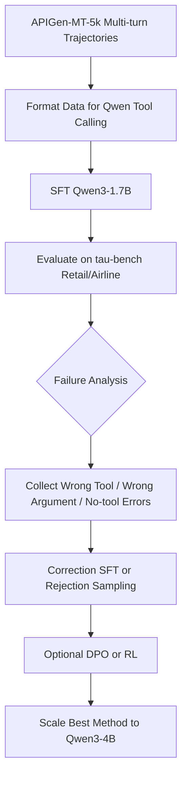

# Small-LLM: Training Qwen3 for Verified Customer-Support Tool Use

## One-Line Pitch

We train a small open-source model, starting with **Qwen3-1.7B** and later scaling to **Qwen3-4B**, to behave like a real customer-support agent.

The model must learn to:

- decide when a tool is needed
- choose the correct tool
- pass the right arguments
- understand tool outputs
- continue across multiple turns
- follow company policies
- know when **not** to call a tool

The goal is not just valid function calling. The goal is verified task completion.

---

## Problem Statement Match

Our problem statement asks for a small model that can act like an agent instead of a normal chatbot.

A correct agent should be able to:

```text
User request
↓
Decide if action is needed
↓
Call the right tool
↓
Read tool result
↓
Decide the next step
↓
Finish the task correctly
```

Customer support is a strong setting for this because real support tasks naturally involve both:

- tool-use cases, such as refunds, cancellations, order lookup, address changes
- no-tool cases, such as answering policy questions or clarifying missing information

This lets us test whether the model actually understands when tools are useful.

---

## Why Customer Support?

Customer support is one of the cleanest domains for training and evaluating small tool-using models.

It gives us:

| Requirement | Why Customer Support Fits |
|---|---|
| Tool calling | Support agents need tools for orders, refunds, bookings, cancellations |
| Multi-turn reasoning | Customers often reveal information slowly |
| Policy following | Refunds, exchanges, cancellations, and changes have rules |
| No-tool behavior | Some questions only need a direct answer |
| Objective evaluation | We can check if the database reached the correct final state |
| Realistic agent workflow | The model must plan, act, observe, and respond |

This makes customer support a safer and more measurable project than domains where correctness is subjective.

---

## Final Project Direction

We use existing open-source infrastructure instead of building everything from scratch.

The project is based on:

1. **APIGen-MT-5k** for multi-turn agent training data
2. **τ-bench / τ²-bench** for customer-support environments and automatic evaluation
3. **Qwen3-1.7B** as the first small model
4. **Qwen3-4B** as the final scaled model

The central idea:

```text
Train Qwen3 to become a verified customer-support tool-using agent.
```

---

## Dataset: APIGen-MT-5k

We use [APIGen-MT-5k](https://huggingface.co/datasets/Salesforce/APIGen-MT-5k), a dataset released by Salesforce for multi-turn agentic tool use.

APIGen-MT contains **5,000 multi-turn trajectories** generated for realistic human-agent interactions.

Each trajectory can include:

- user messages
- assistant responses
- tool/API calls
- tool results
- multi-turn interaction flow
- task completion behavior

This is useful because the model does not only learn isolated JSON tool calls. It learns complete agent behavior:

```text
user request
→ assistant decides action
→ tool call
→ tool result
→ assistant continues
→ final response
```

APIGen-MT is especially useful for our project because it was designed for **verifiable multi-turn agent data**.

---

## Environment: τ-bench / τ²-bench

We use the τ-bench family of customer-support benchmarks.

Official resources:

- [τ-bench website](https://taubench.com/)
- [τ-bench / τ²-bench GitHub](https://github.com/sierra-research/tau2-bench)
- [APIGen-MT project page](https://apigen-mt.github.io/)

τ-bench provides simulated customer-support domains where an agent must:

- converse with a user
- call tools
- follow policies
- modify a database
- complete the task correctly

The environment includes domains such as:

- retail support
- airline support
- telecom support in newer benchmark versions

The important part is that τ-bench provides **automatic scoring**.

Instead of manually judging answers, the environment checks:

```text
Did the database reach the correct final state?
Did the agent follow policy?
Did the customer receive the required confirmation?
Did the agent avoid invalid or unnecessary tool calls?
```

This makes our evaluation objective and reproducible.

---

## Tools

The exact tools depend on the τ-bench domain, but the model will generally learn to use tools like:

```text
look_up_order
look_up_customer
cancel_order
refund_order
exchange_item
update_address
check_policy
search_booking
cancel_booking
rebook_flight
```

The model must learn three behaviors:

### 1. Read-only tool use

Example:

```text
Customer: Where is my order?
Agent: calls order lookup tool
```

### 2. State-changing tool use

Example:

```text
Customer: Cancel my booking.
Agent: checks policy, verifies booking, cancels if allowed
```

### 3. No-tool response

Example:

```text
Customer: What is your refund policy?
Agent: answers directly if the policy is already available
```

The no-tool case is very important because small models often overuse tools.

---

## Training Architecture



---

## Training Plan

### Stage 1: Baseline Evaluation

First, we run the base Qwen3-1.7B model on τ-bench without fine-tuning.

This gives us a baseline.

Metrics:

- task success rate
- tool selection accuracy
- argument accuracy
- invalid tool-call rate
- unnecessary tool-call rate
- policy violation rate

This tells us how weak the base model is before training.

---

### Stage 2: Supervised Fine-Tuning

We fine-tune Qwen3-1.7B on APIGen-MT-5k using QLoRA.

The model learns:

- tool-call format
- multi-turn support flow
- when to call a tool
- when not to call a tool
- how to use tool outputs
- how to finish a customer request

The first goal is not reinforcement learning.

The first goal is:

```text
Make the small model reliably imitate correct multi-turn tool-use behavior.
```

---

### Stage 3: Evaluation After SFT

After fine-tuning, we evaluate the model again on τ-bench.

We compare:

```text
Base Qwen3-1.7B
vs
SFT Qwen3-1.7B
```

Expected improvement areas:

- better valid tool-call formatting
- better tool choice
- fewer missing arguments
- better multi-turn continuation
- fewer unnecessary tool calls
- better final task success

---

### Stage 4: Failure Mining

We collect the model's mistakes.

Failure types:

| Failure Type | Example |
|---|---|
| Wrong tool | Calls refund tool instead of lookup tool |
| Missing argument | Calls cancel tool without order ID |
| Invalid JSON | Tool call cannot be parsed |
| Policy violation | Refunds when refund is not allowed |
| Tool overuse | Calls a tool for a simple policy answer |
| Early stopping | Does not continue after tool result |
| Wrong final answer | Tool succeeded but user response is incorrect |

These failures become new training examples.

---

### Stage 5: Correction SFT / Rejection Sampling

We generate or curate corrected versions of failed trajectories.

Then we train again.

This stage teaches the model to avoid its own common mistakes.

Example:

```text
Bad behavior:
Customer asks a policy question.
Model calls refund_order unnecessarily.

Correct behavior:
Model answers the policy question without calling a tool.
```

This directly improves the "know when not to use tools" requirement.

---

### Stage 6: Optional DPO or RL

If time permits, we use preference optimization or reinforcement learning.

DPO examples:

| Chosen | Rejected |
|---|---|
| Correct tool call | Wrong tool call |
| Valid arguments | Missing arguments |
| Follows policy | Violates policy |
| No tool when not needed | Unnecessary tool call |
| Completes task | Stops early |

τ-bench's automatic scorer can also be used as a reward signal because the environment can check whether the final task was completed correctly.

However, RL is treated as a stretch goal.

Primary deliverable:

```text
SFT + verified evaluation
```

Stretch goal:

```text
DPO / RL with environment reward
```

---

### Stage 7: Scale To Qwen3-4B

After proving the method on Qwen3-1.7B, we apply the best training setup to Qwen3-4B.

The same pipeline is reused:

```text
APIGen-MT-5k
↓
SFT
↓
τ-bench evaluation
↓
failure mining
↓
optional preference optimization
```

---

## Evaluation Metrics

We evaluate the model using both tool-level and task-level metrics.

| Metric | What It Checks |
|---|---|
| Task success rate | Did the customer-support task finish correctly? |
| Tool selection accuracy | Did the model choose the right tool? |
| Argument accuracy | Did the model pass the correct fields? |
| JSON validity | Was the tool call parseable? |
| Policy compliance | Did the model follow support rules? |
| No-tool accuracy | Did the model avoid tools when no tool was needed? |
| Multi-turn completion | Did the model continue correctly after tool outputs? |
| Database final-state accuracy | Did the environment end in the expected state? |

The most important metric is:

```text
End-to-end task success rate
```

Because valid tool calls alone are not enough.

---

## Three-Week Plan

| Week | Goal | Deliverable |
|---|---|---|
| Week 1 | Install τ-bench / τ²-bench and run baseline Qwen3-1.7B | Baseline task success and error report |
| Week 2 | Fine-tune Qwen3-1.7B on APIGen-MT-5k | SFT model + post-training evaluation |
| Week 3 | Failure mining, correction SFT or DPO, then scale to Qwen3-4B | Final model comparison and results |

---

## Expected Outcome

By the end of the project, we expect to have:

- a working τ-bench evaluation setup
- baseline Qwen3-1.7B results
- fine-tuned Qwen3-1.7B results
- error analysis of tool-use failures
- improved model through correction SFT or DPO
- final Qwen3-4B experiment
- objective success metrics

The final result should show whether small models can become reliable tool-using agents when trained on high-quality multi-turn data.

---

## Why This Project Is Strong

Most small-model tool-use projects stop at:

```text
Did the model output valid function-call JSON?
```

This project goes further.

We check:

```text
Did the model actually solve the customer's problem?
```

That makes the project stronger because the evaluation is based on real environment outcomes, not just formatting.

The model succeeds only if:

- the correct tools were used
- the right arguments were passed
- policies were followed
- the database reached the correct final state
- the customer received the correct final response

---

## Scope

We are not building a general chatbot.

We are training a small model to become a verified customer-support tool-using agent.

We are not relying on manual grading.

We use executable environments and automatic scoring wherever possible.

We are not claiming that small models can solve every agentic task. We are testing whether small models can become reliable in a focused tool-use setting when trained on high-quality multi-turn trajectories.

---

## Limitations

- APIGen-MT-5k may not cover every possible customer-support edge case.
- τ-bench performance can be sensitive to prompt formatting and tool schema design.
- RL may be unstable or time-consuming, so it is treated as a stretch goal.
- Training directly on benchmark tasks may cause leakage, so evaluation must use held-out or clearly separated tasks.
- Qwen3-1.7B may still struggle with long multi-turn conversations and policy-heavy cases.

---

## References

- [APIGen-MT Project Page](https://apigen-mt.github.io/)
- [APIGen-MT-5k Dataset](https://huggingface.co/datasets/Salesforce/APIGen-MT-5k)
- [τ-bench Website](https://taubench.com/)
- [τ-bench / τ²-bench GitHub](https://github.com/sierra-research/tau2-bench)
- [APIGen-MT Paper](https://arxiv.org/abs/2504.03601)
