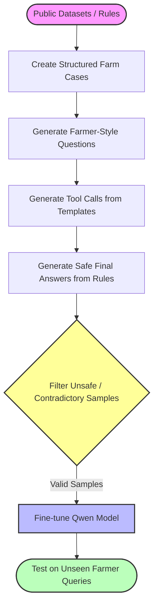

# Small-LLM
Tough , but interesting .
Main issue - Dataset avail , but all scattered . Need to combine all of that dataset.

| Dataset Type                     | Use In Tool                                     | Sources                                                                                                                                                        |
| -------------------------------- | ----------------------------------------------- | -------------------------------------------------------------------------------------------------------------------------------------------------------------- |
| Crop recommendation data         | `crop_selector`, `soil_rule_checker`            | [Kaggle Crop Recommendation Dataset](https://www.kaggle.com/datasets/atharvaingle/crop-recommendation-dataset)                                                 |
| Crop disease images              | `disease_symptom_matcher` / vision add-on later | [PlantVillage GitHub](https://github.com/spMohanty/plantvillage-dataset), [TensorFlow PlantVillage](https://www.tensorflow.org/datasets/catalog/plant_village) |
| Indian agriculture district data | yield, rainfall, irrigation, crop patterns      | [ICRISAT District Level Data](https://data.icrisat.org/dld/)                                                                                                   |
| Crop yield + weather             | `weather_risk_tool`, `yield_risk_tool`          | [Indian Historical Crop Yield and Weather Data](https://www.kaggle.com/datasets/zoya77/indian-historical-crop-yield-and-weather-data)                          |
| Pest/disease field data          | more realistic disease/pest examples            | [CCMT crop pest and disease dataset paper](https://pmc.ncbi.nlm.nih.gov/articles/PMC10285554/)  |


We can build for some specific types of crops initially . Eg- Wheat ,Rice,Tomato . Why these ? These crops cover very different behaviour .

| Crop | Agricultural Profile | Focus Area for Agent |
| :--- | :--- | :--- |
| **Wheat** | Staple crop | Stage-based irrigation and fertilization workflows |
| **Rice** | Water-intensive crop | Heavy dependency tracking on rain and water levels |
| **Tomato** | High-maintenance crop | Disease and pest-heavy tracking for symptom matching |

Our model does not need to know much about agriculture but it should just know tool calling , tool combining , safe answering etc.

*   **`extract_farm_context`**: Parses raw inputs to extract crop type, plant age, location, reported symptoms, soil metrics, and local weather.
*   **`crop_stage_tool`**: Calculates the exact crop growth stage based on days elapsed after sowing.
*   **`weather_risk_tool`**: Detects environmental stress factors like drought, heavy rain, heat waves, or high humidity.
*   **`soil_suitability_tool`**: Evaluates NPK levels, soil pH, and moisture suitability for the specific crop.
*   **`symptom_matcher`**: Maps physical crop symptoms to likely diseases, nutrient deficiencies, or environmental stresses.
*   **`safe_action_checker`**: Acts as a guardrail to block and prevent dangerous or unapproved pesticide and fertilizer recommendations.

## Pipeline


We have a good dataset for crops/disease/rainfall for India . What we lack is for farmers Nat. style lang ques which we need to curate , same applied for Tool use trajectory and rules.

## Structured farm cases 
Sample case - 
```
{
  "crop": "tomato",
  "age_days": 35,
  "stage": "vegetative",
  "symptoms": ["leaf curling", "white insects under leaves"],
  "soil": {
    "moisture": "dry",
    "ph": 6.4
  },
  "weather": {
    "temperature": 34,
    "rain_forecast_days": 0,
    "humidity": 45
  },
  "likely_issue": "whitefly stress",
  "safe_action": "inspect underside of leaves, avoid overwatering, consult local expert before pesticide"
}
```
## Cases to questions 
My {crop} is {age_days} days old. I see {symptoms}. Soil is {soil_moisture}. What should I do?

## Tool Use
Sample tool use case-
Sample tool use case:

```json
{
  "tool_calls": [
    {
      "tool": "extract_farm_context",
      "arguments": {
        "crop": "tomato",
        "age_days": 35,
        "symptoms": [
          "leaf curling",
          "white insects under leaves"
        ],
        "soil_moisture": "dry",
        "weather": "hot and dry"
      }
    },
    {
      "tool": "crop_stage_tool",
      "arguments": {
        "crop": "tomato",
        "age_days": 35
      }
    },
    {
      "tool": "symptom_matcher",
      "arguments": {
        "crop": "tomato",
        "symptoms": [
          "leaf curling",
          "white insects under leaves"
        ]
      }
    },
    {
      "tool": "weather_risk_tool",
      "arguments": {
        "temperature": 34,
        "humidity": 45,
        "rain_forecast_days": 0
      }
    },
    {
      "tool": "safe_action_checker",
      "arguments": {
        "issue": "whitefly stress",
        "advice_type": "pest_control"
      }
    }
  ]
}
```

## Rule - based answering
Rules can be set up for like involvment of pesticide / if anything missing from the question ( ie crop , symptoms [for symptoms we can add like if the farmer does not understand ]).

Missing info - If user asks something which does not include crop / crop age / weather etc. , follow up question from the chatbot can be 
`Which crop is this, how many days old is it?`


