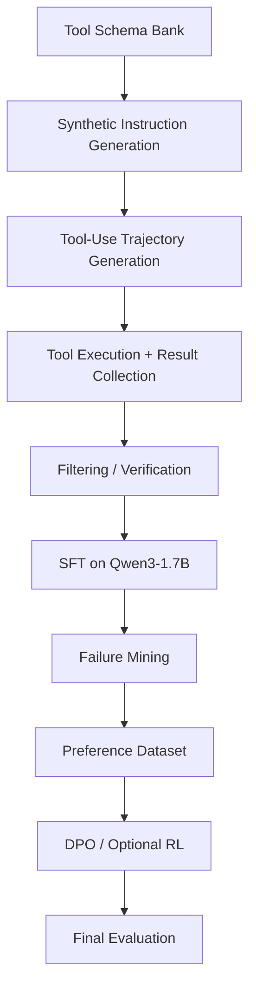
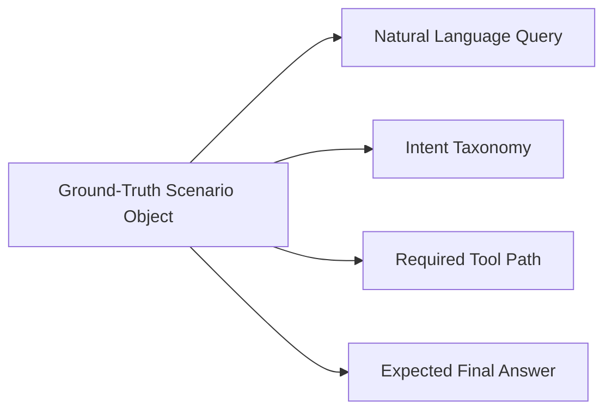
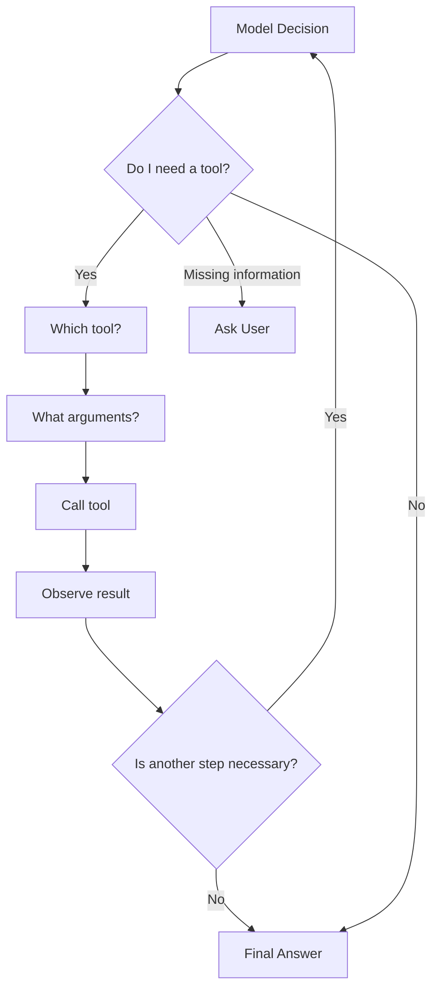
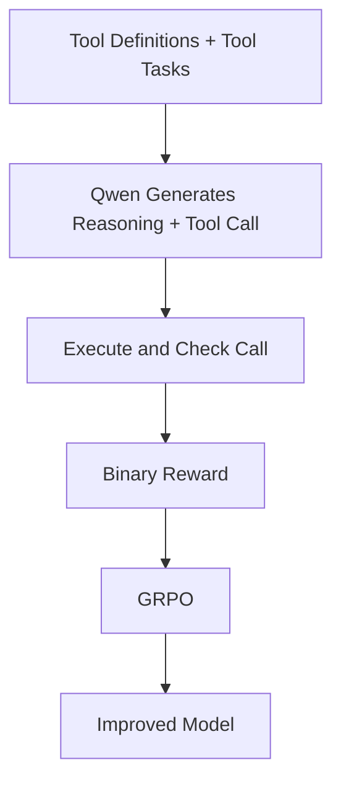
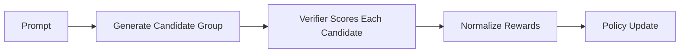
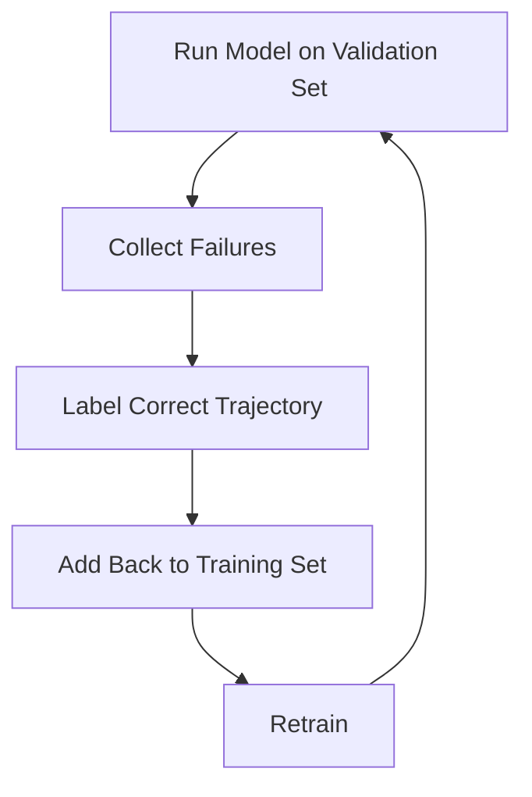

# Tool-Use Training Architecture

> A training architecture for teaching small instruction models like **Qwen3-1.7B-Instruct** when to call tools, how to pass arguments, how to use tool results, and when to produce a final answer.

## Overview

This project explores a tool-use training pipeline inspired by:

- **ToolFormer**: teaches tool call insertion and argument passing.
- **ReAct**: uses reasoning -> tool call -> observation -> next step.
- **ToolLLM**: improves multi-tool search using tool hierarchies.
- **RAFT-style grounding**: trains with relevant documents and distractors.
- **GRPO / RL-based training**: improves tool calling using verifier rewards.

## High-Level Pipeline



## Core Training Ideas

### ToolFormer

ToolFormer teaches the model:

- When to call tools.
- Which tool to call.
- How to pass arguments.
- How to filter unsafe or incorrect tool trajectories.

### ReAct

ReAct follows an iterative pattern:

```text
User question
-> model reasoning
-> tool call
-> tool observation
-> next model decision
-> final answer
```

This prevents the model from blindly answering in one step.

### ToolLLM

ToolLLM introduces multi-tool hierarchy information.

This can help construct a decision tree that expands the search space and improves the chance of finding a valid tool-use path.

## Training Architecture

The full training architecture contains the following stages:

1. Tool Schema Bank
2. Synthetic Instruction Generation
3. Tool-Use Trajectory Generation
4. Tool Execution + Result Collection
5. Filtering / Verification
6. SFT on Qwen3-1.7B
7. Failure Mining
8. Preference Dataset
9. DPO / Optional RL
10. Final Evaluation

## Instruction Generation

The instruction-generation process should create a structured scenario first, then convert it into natural language.



The ground-truth scenario object should be maintained independently from the natural language query.

## Tool-Use Trajectory Generation

The model receives a current state:

```text
S_t = user question
    + previous decisions
    + previous tool calls
    + previous results
    + available information
```

The model then chooses an action:

```text
A_t ∈ {
    TOOL_CALL,
    FINAL_ANSWER,
    ASK_USER
}
```

The learned policy is:

```text
A_t = π(S_t)
```

## Model Decision Flow



## Tool Execution + Result Collection

The teacher should never invent tool results.

Tool outputs should come from actual execution because invented outputs can teach the model false behavior.

Initially, deterministic tools should be used because they provide:

- Reproducibility
- Stable evaluation
- Easier debugging
- Repeatable trajectory generation

Static data, such as CSV files, can also be used.

## Filtering / Verification

Quality control should check:

| Check | Purpose |
| --- | --- |
| Schema Validity | Ensures the tool call matches the schema |
| Tool Existence | Ensures the selected tool exists |
| Argument Correctness | Ensures arguments are valid |
| Tool Necessity | Ensures the tool was actually needed |
| Result Consistency | Ensures the answer uses the result correctly |
| Safety Verification | Ensures safe behavior |

## Domain Grounding

Use a RAFT-style setup:

- Provide relevant documents.
- Add distractor documents.
- Train in an open-book setting.
- Reward correct evidence usage.
- Penalize unsupported or noisy reasoning.

## Supervised Fine-Tuning

The model can be trained with a structured format:

```xml
<think>
Reason about whether a tool is needed and which tool should be used.
</think>

<tool_call>
{
  "tool_name": "...",
  "parameters": {
    "X": "...",
    "Y": "...",
    "Z": "..."
  }
}
</tool_call>
```

The model should learn:

- When a tool is needed.
- Which tool to use.
- How to format arguments.
- How to interpret tool results.
- When to stop and answer.

## Reinforcement Learning Setup

A Nemotron-style RL pipeline can be used:



## Reward Structure

A simple binary reward can be:

```text
R = 1 if format and tool call are correct
R = 0 otherwise
```

A more detailed reward can include:

| Reward | Meaning |
| --- | --- |
| R_tool | Correct tool selected |
| R_args | Correct arguments passed |
| R_result | Tool result used correctly |
| R_answer | Final answer is correct |
| R_safety | Safety constraints pass |

Composite reward:

```text
R_total =
    α * R_tool
  + β * R_args
  + γ * R_result
  + δ * R_answer
  + ε * R_safety
```

Both reward structures should be implemented and compared.

## GRPO Workflow

GRPO generates multiple candidate outputs:

```text
G = {
    y1, y2, y3, y4,
    y5, y6, y7, y8
}
```

Each output is evaluated by the reward function.



## Failure Mining

Failure mining should be an iterative loop:



Common failure types:

- Wrong tool selected
- Incorrect arguments
- Unnecessary tool call
- Missing tool call
- Incorrect use of tool result
- Early final answer
- Safety failure

## Final Evaluation

Evaluation should measure the full tool-use workflow.

| Metric | Measures |
| --- | --- |
| Tool Selection Accuracy | Whether the correct tool was selected |
| Argument Accuracy | Whether arguments were correct |
| Execution Success Rate | Whether the tool call ran successfully |
| Result-Use Accuracy | Whether the result was used correctly |
| Final Answer Accuracy | Whether the answer was correct |
| Safety Pass Rate | Whether safety checks passed |

## Proposed Experiments

| Experiment | Description |
| --- | --- |
| SFT Baseline | Train using verified trajectories |
| Pure RL | Train directly using verifier rewards |
| SFT + RL | Start with SFT, then improve with GRPO |
| SFT + DPO | Use preference pairs from good and bad trajectories |

## Summary

This architecture trains a model to:

1. Understand the user query.
2. Decide whether a tool is needed.
3. Select the correct tool.
4. Generate valid arguments.
5. Execute the tool.
6. Use the tool result correctly.
7. Produce a grounded final answer.

The recommended path is:

```text
SFT Baseline -> Pure RL Experiment -> SFT + GRPO Comparison
```
